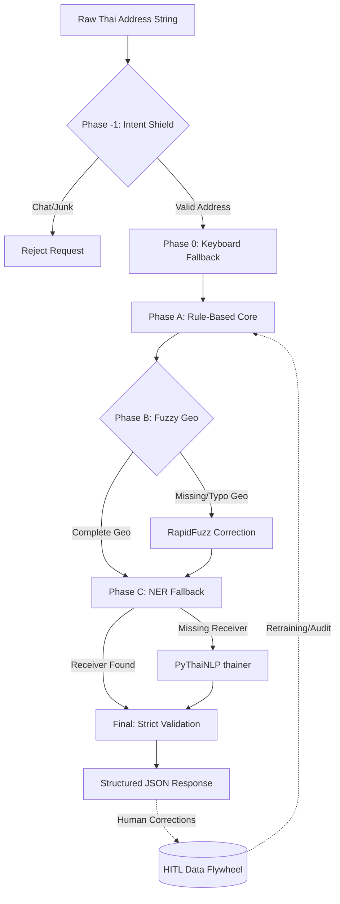

# ThaiSmartAddress v7.0

A production-grade, hybrid NLP REST API designed specifically to parse raw, unstructured Thai delivery addresses into structured data (Receiver, Phone, Address Detail, Sub-district, District, Province, Zipcode, and Tags).

Built with FastAPI, it combines deterministic rule-based elimination, fuzzy matching (RapidFuzz), and Named Entity Recognition (PyThaiNLP) to handle typos, missing prefixes, and English-layout Thai typos. It features a Human-In-The-Loop (HITL) Data Flywheel for continuous improvement through logged corrections.

---

## Key Features

- **Hybrid NLP Pipeline:** 6-phase parsing (Intent Shield -> Keyboard Fallback -> Rule-Based Core -> Fuzzy Geo -> NER Fallback -> Strict Validation).
- **Fuzzy Typo Correction:** Automatic correction of misspelled sub-districts, districts, and provinces using RapidFuzz.
- **Zero-Setup Geographic DB:** Loads ~150k canonical Thai address rows from `thai_address_full.csv` with O(1) lookups.
- **HITL Data Flywheel:** Persistent SQLite database logs human corrections via `/api/feedback` to track model accuracy over time.
- **Industrial Admin Dashboard:** A monochromatic, control-room-themed web UI to test addresses, view parsed JSON, and submit manual corrections.
- **Enterprise-Ready:** Includes structured JSON logging, Prometheus metrics, sliding-window rate limiting, and timing-safe API Key authentication.
- **Dockerized:** Multi-stage Docker build optimized for rapid deployment.

---

## System Architecture & Pipeline

The following diagram illustrates the request flow from raw text input to structured JSON output, including the feedback loop for continuous model improvement.



### Pipeline Phases Explained

1. **Phase -1: Intent Shield** - Filters out non-address chat junk based on negative keywords and digit density.
2. **Phase 0: Keyboard Fallback** - Auto-corrects text typed with an English keyboard layout while intending to type Thai.
3. **Phase A: Rule-Based Core** - Normalizes Thai text, extracts phone numbers and zipcodes, maps geographies, extracts delivery tags, and extracts receiver details.
4. **Phase B: Fuzzy Geo** - If geographic tokens are incomplete, RapidFuzz scans for typo-corrected matches against the canonical database.
5. **Phase C: NER Fallback** - If the receiver's name is still missing, PyThaiNLP `thainer` runs via a dedicated worker thread to extract PERSON entities.
6. **Final: Strict Validation** - Computes a confidence score (0.0 - 1.0) and flags low-quality results.

---

## Quick Start

### Using Docker Compose (Recommended)

1. Clone the repository and provide the geographic data:
   ```bash
   git clone https://github.com/Nawxtz/Thai-smart-address.git
   cd Thai-smart-address
   mkdir -p ./data
   # Place thai_address_full.csv in the ./data folder
   ```

2. Generate an API Key and export it:
   ```bash
   export API_KEY=$(python -c "import secrets; print(secrets.token_urlsafe(32))")
   ```

3. Build and run the services:
   ```bash
   docker-compose up --build
   ```
   - **API:** `http://localhost:8000`
   - **Admin Dashboard:** `http://localhost:3000`

### Running Locally (Development)

```bash
# Create virtual environment and install dependencies
python -m venv venv
source venv/bin/activate  # or venv\Scripts\activate on Windows
pip install -r requirements.txt

# Run the FastAPI server
python api.py
```

---

## API Endpoints

| Method | Endpoint | Description | Auth |
| :--- | :--- | :--- | :--- |
| `POST` | `/api/parse` | Parse a single raw Thai address string. | Optional |
| `POST` | `/api/parse/batch` | Parse a batch of addresses (up to 100). | Optional |
| `POST` | `/api/feedback` | Submit a human correction to the Data Flywheel. | Optional |
| `GET` | `/api/corrections` | List recent logged corrections. | Yes |
| `GET` | `/api/health` | Liveness probe (exposes DB degradation states). | No |
| `GET` | `/api/info` | Server metadata and version info. | Yes |
| `GET` | `/metrics` | Prometheus metrics for observability. | No |

---

## Project Structure

```text
├── api.py             # FastAPI REST server, middleware, and endpoints
├── parser.py          # The core SmartAddressParser (Hybrid NLP Pipeline)
├── geo_engine.py      # O(1) GeoDatabase loader and RapidFuzzy matcher
├── constants.py       # Compiled regexes, abbreviations, and linguistic resources
├── models.py          # Pydantic schemas and Data Transfer Objects (Dataclasses)
├── database.py        # SQLAlchemy SQLite integration for the HITL Flywheel
├── evaluate.py        # Academic evaluation script for NLP metrics (Accuracy, F1)
├── app.js             # Admin Dashboard frontend logic
├── index.html         # Admin Dashboard UI (Industrial Control Room theme)
├── Dockerfile         # Multi-stage Docker build for the API
├── docker-compose.yml # Service orchestration (API + Nginx Dashboard)
└── data/              # Directory for thai_address_full.csv
```

---

## Environment Variables

| Variable | Default | Description |
| :--- | :--- | :--- |
| `GEO_CSV_PATH` | `data/thai_address_full.csv` | Path to the canonical Thai address database. Falls back to a 26-row mock DB if missing. |
| `DB_PATH` | `feedback_logs.db` | Path to the SQLite database used for storing feedback corrections. |
| `API_KEY` | *(unset)* | If set, requires `X-API-Key` header for parsing endpoints. |
| `CORS_ORIGINS` | `http://localhost:3000...` | Comma-separated list of allowed CORS origins. |
| `RATE_LIMIT_MAX` | `500` | Maximum requests per IP per sliding window. |
| `RATE_LIMIT_SECS` | `60` | Sliding window duration in seconds. |
| `LOG_LEVEL` | `info` | Logging level (`debug`, `info`, `warning`). |

---

## Evaluation & Metrics

The project includes a built-in evaluation script (`evaluate.py`) to measure the parser's academic and real-world performance:

```bash
python evaluate.py
```

**Metrics tracked:**
- Field-level Accuracy (Province, District, Sub-district, Zipcode, Phone, Receiver)
- Intent Classification (Precision, Recall, F1, TP/TN/FP/FN)
- Fuzzy Matching success rate (Typo correction efficacy)
- Tag Detection accuracy (Urgent, Fragile, Do not fold)
- Confidence score distribution and Average processing time

---

## Security & Observability

- **Rate Limiting:** In-memory sliding-window rate limiter (60 req/min per IP) prevents abuse.
- **Real-IP Middleware:** Correctly resolves client IPs behind reverse proxies (e.g., Nginx, Docker bridge).
- **CORS & API Keys:** Configurable CORS with explicit header whitelisting to prevent CSRF. Timing-safe API Key validation.
- **Prometheus Integration:** Native `/metrics` endpoint exposes latency, error rates, and throughput.
- **JSON Structured Logging:** Uses `python-json-logger` for production-ready log ingestion.
